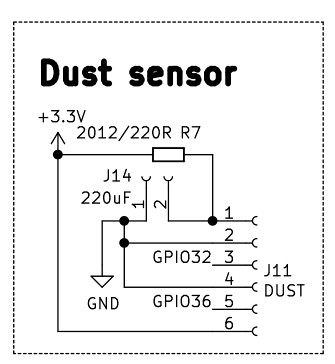

# 미세먼지 센서 사용해보기

Developer Day 2018 뱃지는 마이크로 파이썬이 포팅되어 다양하게 활용 될 수 있습니다. Developer Day 2018 행사와 meetup을 통해 나누어드린 각종 센서도 연결하여 사용 할 수 있습니다. 이 글에서는 다양한 센서중 미세먼지 센서를 어떻게 뱃지와 연결하고 또 소프트웨어는 어떻게 작성하는지에 대해 알려드리고자 합니다.

## 준비 사항

마이크로 파이썬 WebREPL 개발 환경이 준비되지 않은 경우 [REPL & WebREPL 가이드](../repl/README.md)를 참고하여 준비해 주어야 합니다.

Developer Badge Firmware v2.3을 기반으로 설명합니다. 하위 버젼인 경우 [IoT 뱃지 위에 ROM 설치하기](../firmware/README.md)를 참고하여 롬 업그레이드를 해 주셔야 합니다.

그리고, 미세먼지 센서를 Developer Day 2018 뱃지와 연결하려면 **실납(lead)** 과 이를 이용할 **납땜인두(iron)** 가 필요합니다. *인두 사용시 **화상**을 입을 수 있으므로 주의 하시기 바랍니다*.

## 센서 정보

미세먼지 센서는 Sharp 전자의 **GP2Y1014AU0F** 제품입니다. 같은 회사의 미세먼지 센서인 **GP2Y1010AU** 의 개선품이라고 합니다. 거의 동일한 특성을 가지고 있고 참고 자료는 더 많으므로 이를 활용하는 것도 좋습니다.

* http://www.sharp-world.com/products/device/lineup/data/pdf/datasheet/gp2y1010au_appl_e.pdf

GP2Y1014AU0F 센서는 PM2.5 까지 측정이 가능하며, 공기 중 적외선 투과도를 측정하여 대기 중 먼지 밀도를 측정하는 센서입니다. 센서에 대한 상세 규격 정보는 아래와 같이 각 제품 공급 홈페이지에서 확인 할 수 있으니 참고 하기 바랍니다.

* [DigiKey](https://www.digikey.kr/product-detail/ko/sharp-socle-technology/GP2Y1014AU0F/1855-1013-ND/7674923)
* [Mouser](https://kr.mouser.com/ProductDetail/Sharp-Microelectronics/GP2Y1014AU0F?qs=rrS6PyfT74eynj5J61tvwA%3D%3D)
* [LCSC](https://lcsc.com/product-detail/Sensor-Modules_Sharp-Microelectronics-GP2Y1014AU0F_C134069.html)
* [Device Mart](https://www.devicemart.co.kr/goods/view?no=1327422)

> ※ 참고 사항  
> Developer Day 2018 뱃지의 동작 전원은 3.3V이고 GP2Y1014AU0F는 5V입니다. 일반적인 경우라면 3.3-5V 레벨 변환 회로가 필요합니다. 그러나, 레벨 변환 회로 구성에 따른 전반적인 복잡도 증가 및 GP2Y1014AU0F가 3.3V 환경에서도 어느정도 일정한 결과가 나오는 것을 확인했기에, Developer Day 2018 뱃지에는 별도의 레벨 변환 회로 없이 구성 되었습니다.

## 하드웨어 구성

위의 제품 규격 문서에는 이 센서의 사용 방법과 테스트 조건 및 환경에 대한 정보가 있으므로 이를 참고합니다. 아래는 GP2Y1014AU0F의 내부 구성에 대한 그림입니다. 


간략히 설명하면, LED라는 모듈에서 전원을 공급하여 빛(LED)을 쏘면 대기중 먼지 밀도에 따른 빛 투과량을 `Light detector`가 감지하고 이를 전기적 신호로 변환하여 `Vo` 핀으로 내보냅니다. 이 `Vo`의 전압을 측정하여 대기중 먼지 밀도로 변환하는 방식으로 구성합니다.

다음과 같이 회로를 구성합니다. 회로 자체는 그리 복잡하지 않지만 미세먼지 센서 이외 150옴 저항, 220마이크로 패럿 콘덴서가 추가로 필요합니다. 


Developer Day 2018 뱃지에는 여러가지 센서를 바로 붙여서 사용 할 수 있도록 준비되어 있는데 미세먼지 센서용 220옴 저항이 내장되어 있으므로 먼지 센서 연결선 6개 핀과 220uF 콘덴서만 추가해 주면 됩니다.


아래 회로도는 먼지 센서와 콘덴서가 연결되는 부분입니다.



콘덴서는 J14, 6핀 커넥터는 J11로 연결됩니다.


패키지의 콘덴서는 아래 그림과 같이 회색 표시가 된 부분을 보이도록 하여 납땜 합니다.


그리고, 케이블은 다음과 같은 순서로 연결하여 땜질합니다.


케이블은 먼지 센서와 연결되는 케이블의 순서에 맞추어야 합니다. 

)

납땜으로 연결된 모습은 아래와 같습니다.

)

이제 케이블 커넥터를 미세먼지 센서와 연결합니다. 커넥터의 방향이 있으나 아래와 같은 방향으로 연결합니다.


## 소프트웨어

소프트웨어도 하드웨어와 마찬가지로 센서 규격 문서의 내용을 참고합니다. 

### ILED 동작

문서에는 10ms 주기로 0.32ms 동안 LED를 점멸하는 펄스(Pulse) 방식으로 테스트 했다고 나와 있으므로 이를 활용하도록 합니다.


LED 회로는 Open Drain 방식으로 동작합니다. 따라서, ILED 값이 LOW면 LED가 켜지고, HIGH면 꺼지게 됩니다.


### Vo 값 확인

타이밍 정보를 보면 Vo 값의 안정화 된 값은 LED가 켜지고 0.28 ms 이후에 적정한 값이 나타나는 것을 볼 수 있습니다.


### 먼지 밀도 계산

출력된 Vo 값과 미세먼지 값의 관계는 센서의 규격 문서에 다음과 같이 나와 있습니다.


실제 그래프는 측정 값으로 만들어진 것으로 참고용이며, 전기 광학 특성에 대한 표는 다음과 같습니다.


여기서 주목할만 부분은 민감도 `K` 값인데, 이 값이 0.5인 경우, 100 ug/m3 당 0.5V씩 변하게 됩니다. 즉, 위 그래프의 먼지 밀도 0.1 mg/m3 당에서 0.5V가 변하는 것을 말합니다. 이를 이용하여 미세먼지 센서의 그래프를 0~0.5 mg/m3 구간을 1차원식으로 표현해 근사값을 얻을 수 있습니다.

미세먼지 없음으로 판단할 `Voc` 값을 y축 절편으로하고 `측정 전압 Vo`와 `미세먼지 밀도 D`의 관계는 다음과 같은 식으로 표현 해 볼 수 있습니다.

> Vo = K * D + Voc

이를 Vo를 X축으로 변형하여 `측정 전압 V`당 `밀도 D`로 표현하면,

> D = ( Vo - Voc ) / K

그런데 K의 단위가 V/100ug/m3이므로 D단위의 단위도 100ug/m3가 됩니다. 즉, 0.5V가 측정되면 100ug/m3이 되는 셈입니다. 그렇다면 밀도 단위를 좀 변경하여 1ug/m3가 측정되려면 0.5/100V 가 됩니다. 따라서, K 값에 100을 나누어 주는 형태가 됩니다.

> D = ( Vo - Voc ) / (K/100) = ( Vo - Voc ) / K * 100

### 예제 코드

이를 종합한 Arduino 예제가 GitHub에 공개되어 있으므로 이를 참고합니다.

* https://github.com/sharpsensoruser/sharp-sensor-demos/blob/master/sharp_gp2y1014au0f_demo/sharp_gp2y1014au0f_demo.ino

위의 코드를 참고하여 Developer Day 2018 뱃지용 코드를 아래와 같이 작성 할 수 있습니다.

먼저, 센서가 연결된 Pin 정보를 입력합니다. LED On/Off용은 GPIO32번,센서의 Vo이 입력될 핀은 GPIO36번 입니다.


``` python
sharpLEDPin = Pin(32, Pin.OUT)
sharpVoPin = ADC(Pin(36))
```

그 다음은 ESP32용 Analog Digital Converter의 입력을 3.9V까지 입력 받을 수 있도록 11dB attenuation을 설정해 줍니다. 단, 전압이 높아지면 정확도가 떨어지지만 미세먼지 센서에서 높은 전압은 크게 정밀할 필요는 없어보입니다.

``` python
sharpVoPin.atten(ADC.ATTN_11DB)
```

ESP32는 ADC에 12비트를 사용하므로 0 ~ 4095까지 검출됩니다. 따라서 이를 적용합니다.

``` python
Vo = VoRaw / 4095.0 * 3.3;
```

참고로, Vo 환산 시 5V가 아닌 3.3V를 기준으로 계산하는데 이는 센서에 입력되는 전압이 3.3V라 비례 값으로 동작할 뿐 실제 5V에서와 동일한 전압을 출력하지 않기 때문입니다.

완성된 예제 코드는 아래 소스 코드를 참고하시기 바랍니다.

* [예제 코드](dust.py)

### 센서 값 안정화

센서 측정 값을 그래프로 보면 일정한 값이 아닌 분산된 형태로 나타나는 것을 볼 수 있습니다.


이는 GP2Y1014AU0F 센서는 광학적 특성으로 인해 발생한다고 추측 되는 것인데, 먼지라는 것이 일상 속에 일정한 크기로 안정된 형태로 존재하지 않기 때문에 센서에 검출되는 상황에 따라 다양하게 변할 수 있기 때문입니다. 따라서, 분산된 Vo 값들의 이동 평균 값을 계산한다면 어느 정도 노이즈를 제거하고 안정된 Vo값을 얻을 수 있습니다. 이동 평균에 대한 정보는 아래 링크의 정보를 참고 할 수 있습니다.

* [샤프 미세먼지 센서는 쓰레기가 아니었다 !!! - 새다리 종합 기록실
](https://m.blog.naver.com/twophase/221139319142)

* [예제 코드 - 이동 평균 적용본](dust_average.py)

### 센서 측정 타이밍 보정

이동 평균으로 안정된 센서 값을 얻었다면 이번엔 센서 값을 올바르게 읽는지 확인해 보아야 합니다. 마이크로 파이썬이 Realtime OS가 아니기 때문에 GP2Y1014AU0F 규격 문서에서 제시하는 타이밍에 맞춰 동작하기 어렵습니다. 특히나 millisecond의 1/1000 단위인 microsecond로 통제하기란 더욱 쉽지 않습니다.

현재 마이크로 파이쎤 코드에서 time tick으로 ILED ON 후 Vo 값을 읽기 직전까지 시간을 측정해보면 400usec 정도가 소요되는 것을 확인할 수 있습니다. 규격문서에서 제시한 대기 시간인 280usec를 훨씬 넘게 되므로 원하는 peak 값을 못얻을게 됩니다. 그러면 실제 신호는 어떻게 나올까요?

오실로스코프로 ILED 신호와 Vo 신호를 확인해 보면 다음과 같이 나타납니다.


윗쪽 노란색이 ILED이며, 참고로 알아보기 쉽게 HIGH/LOW 반전 상태입니다. 아랫쪽 초록색이 Vo 신호입니다. ILED ON 상태부터 400usec이 지난 부분을 기준은 아래 그림과 같습니다.


예상 대로 Sampling Timing이 어긋나 있는 것을 볼 수 있습니다. 이를 보정하기 위해 약간의 지연 시간을 조정하는 트릭으로 peak 값을 읽을 수 있도록 조정합니다. 이는 다음 예제를 참고 하기 바랍니다.

* [예제 코드 - 타이밍 수정본](dust_adjusted.py)


## 참고

* https://github.com/IBM-Developer-Korea/developer-badge-2018-pcb/blob/master/badge_schemetic_v1.0.pdf
* https://docs.micropython.org/en/latest/library/machine.ADC.html
* https://github.com/sharpsensoruser/sharp-sensor-demos/wiki/Application-Guide-for-Sharp-GP2Y1014AU0F-Dust-Sensor
* https://github.com/sharpsensoruser/sharp-sensor-demos/blob/master/sharp_gp2y1014au0f_demo/sharp_gp2y1014au0f_demo.ino
* https://docs.espressif.com/projects/esp-idf/en/latest/api-reference/peripherals/adc.html
* https://m.blog.naver.com/twophase/221139319142

* http://www.sharp-world.com/products/device/lineup/data/pdf/datasheet/gp2y1010au_appl_e.pdf
* http://www.sharp-world.com/products/device/lineup/data/pdf/datasheet/gp2y1010au_e.pdf
