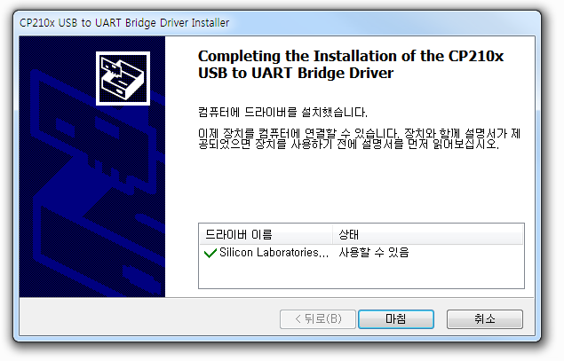
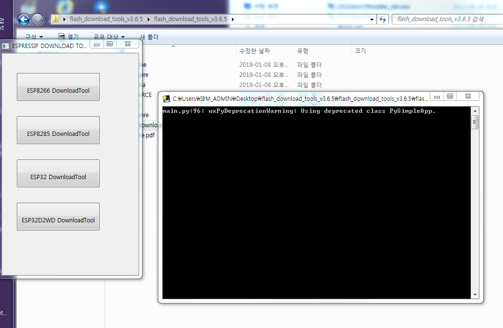
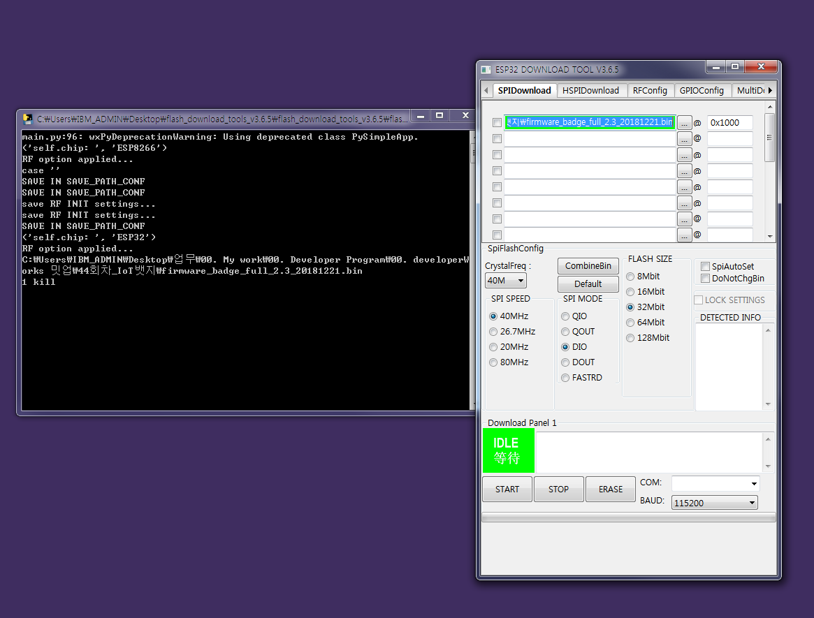
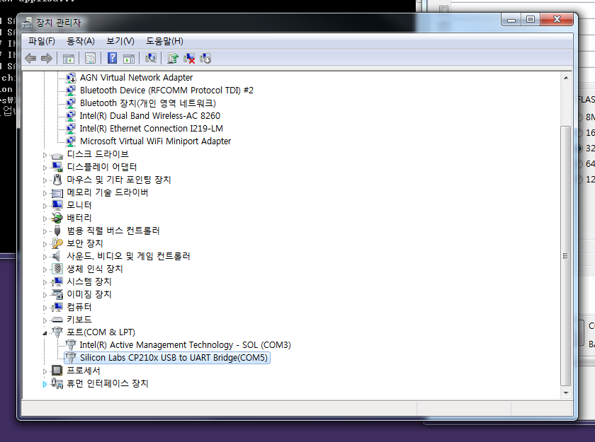

## IoT뱃지 위에 ROM 설치하기
IoT뱃지를 본격적으로 사용해보기 전에 최신 ROM을 올려봅니다.
드라이버를 설치한 후, Flash Download Tool을 통해 IoT뱃지에 ROM을 설치합니다.

## 소요시간
15분 이내

## Steps
### 1. 드라이버 설치하기
아래 링크에서 자신의 운영체제에 맞는 CP210xUSB to UART Bridge VCP 드라이버를 다운로드 합니다.
https://www.silabs.com/products/development-tools/software/usb-to-uart-bridge-vcp-drivers

다운로드한 폴더를 열어 인스톨러를 실행해 다운로드를 마칩니다.

### 2. bin 파일 다운받기

아래 링크에서 IoT뱃지의 펌웨어 파일을 다운로드 합니다.

이 때, 저장하는 경로에 한글이 포함되지 않도록 합니다.

다음 단계인 Flash Download Tool에서 한글을 인식하지 못해 경로를 찾지 못하는 경우가 발생할 수 있습니다.

C드라이브, 혹은 폴더명을 영문으로 하여 저장하는 것을 권장합니다.

* https://badge.arcy.me/firmware_badge_full_2.3_20181221.bin

### 3. IoT뱃지 연결하기

데이터 전송이 가능한 안드로이드 케이블을 이용해 IoT뱃지를 노트북에 연결해줍니다.

### 4. Flash Download Tool 다운받기

로컬파일을 뱃지에 다운로드하기 위한 Flash Download Tool을 설치합니다.

아래 링크에서 ESP32 Flash Download Tool을 다운로드 합니다.

* http://iot-bits.com/esp32/esp32-flash-download-tool-tutorial

### 5. ROM 올리기

다운로드한 폴더를 열어 `flash_download_tools_v3.6.5.exe`를 클릭해 실행합니다.

잠시 후 나타나는 팝업창에서 `ESP32 DownloadTool`을 클릭합니다.

`...`을 눌러 펌웨어 bin 파일을 다운받은 경로를 지정해줍니다.

또 `FrystallFreq`, `SPI SPEED`, `FLASH SIZE`를 화면과 같이 설정해줍니다.

`COM` 값을 설정해주기 위해 `장치 관리자`를 엽니다.

`포트(COM & LPT)`를 클릭해 `Sillicon Labs CP210x USB to UART Bridge`의 `COM` 값을 확인합니다.

`COM`값을 선택해주고, `BAUD` 값은 921600으로 설정합니다.

`START`버튼을 누릅니다. 다운로드가 완료되어 FINISH로 상태가 변경되면 IoT뱃지를 재부팅합니다.

`Fail`메시지가 뜰 경우, bin 파일이 저장된 경로의 폴더명 등이 한글로 되어있지 않은지 확인합니다.

펌웨어 업그레이드가 완료 되었습니다!

## Summary

* 드라이버 다운로드 : https://www.silabs.com/products/development-tools/software/usb-to-uart-bridge-vcp-drivers
* 펌웨어 파일 : https://badge.arcy.me/firmware_badge_full_2.3_20181221.bin
* Flash Download Tool : http://iot-bits.com/esp32/esp32-flash-download-tool-tutorial
