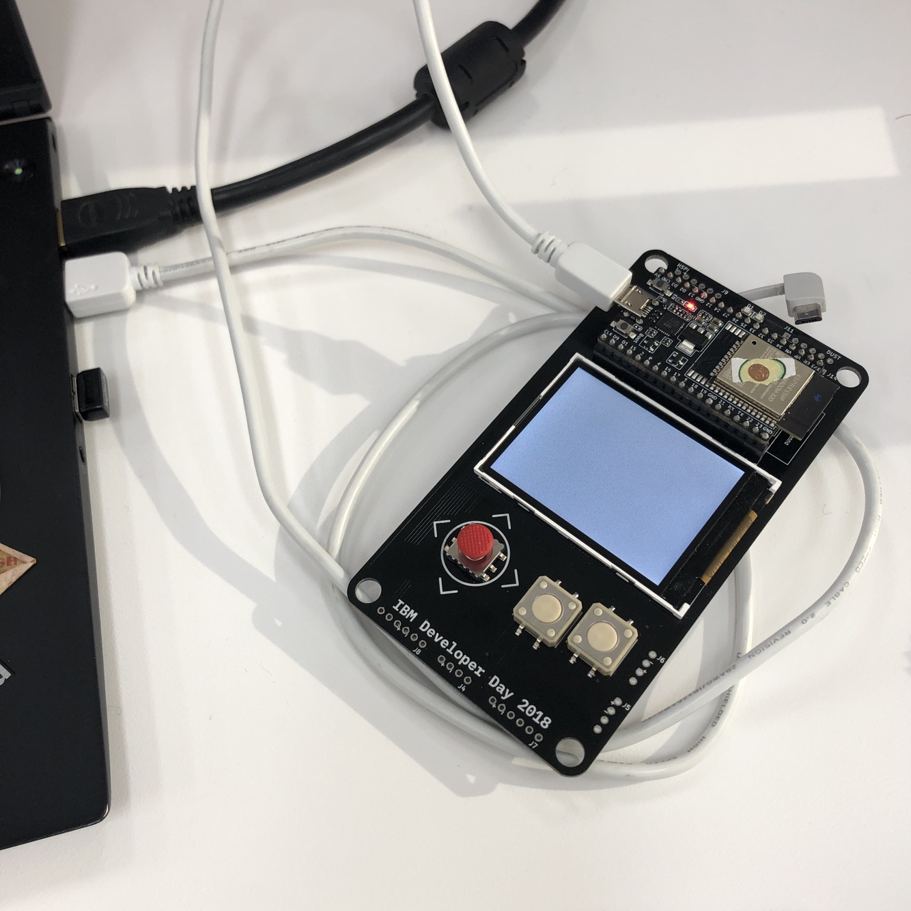

# esptool.py를 이용한 업데이트

IoT 뱃지의 펌웨어를 업데이트 하려면 ESPTool를 이용해야 합니다. ESPTool은 기본적으로 Python을 이용한 CLI 형태로 제공됩니다. 만약 Windows 환경에서 GUI로 진행하고 싶은 경우 [README.md](README.md) 문서를 참고하시기 바랍니다.

## 설치

Python 2.7이나 Python 3.4 이상의 실행 환경이 필요합니다. 다음 명령으로 최신 버젼의 esptool.py를 설치할 수 있습니다.

```
pip install esptool
```

pip가 아닌 수동으로 설치하는 경우 다음 링크를 참고하시기 바랍니다.

* https://github.com/espressif/esptool

## USB 드라이버 설치하기

USB 케이블 연결을 위한 통신 드라이버는 [드라이버 설치하기](README.md#1-드라이버-설치하기)를 참고합니다.

> Mac OS의 버젼이 **OSX Mojave** 인 경우 보안 강화로 인해 드라이버 설치 직후 바로 동작하지 않으므로 다음과 같은 과정으로 드라이버를 활성화 해 주어야 합니다.

1. 우선 Mac과 IoT Badge를 데이터 통신용 USB 케이블로 연결한 후 아래 명령어를 실행하여 드라이버 로딩 상태를 확인합니다.

   ``` bash
   kextstat | grep silabs
   ```

   드라이버가 정상적으로 로딩되어 있다면 `com.silabs.driver.CP210xVCPDriver` 라는 메시지가 출력됩니다.

2. 위 명령에서 만약 어떤 메시지도 출력되지 않는다면 `시스템 환경설정`을 실행하여 `보안 및 개인 정보 보호` 메뉴로 진입합니다.

   `일반` 탭 아랫부분에 차단된 드라이버에 소프트웨어에 대한 정보가 표시되며 `허용` 버튼을 클릭합니다.

   

3. 다시 아래 명령으로 드라이버가 로딩되어 있는지 확인 합니다.

   ``` bash
   kextstat | grep silabs
   ```

## IoT뱃지 연결하기



데이터 전송이 가능한 안드로이드 케이블을 이용해 IoT뱃지를 노트북에 연결해줍니다. 

IoT 뱃지가 노트북에 연결되면 시리얼 포트가 할당되며 일반적으로 `/dev/tty.XXXX` 형태로 구성되므로 정상적으로 생성되었는지 확인해 봅니다.

## bin 파일 다운받기

아래 링크에서 IoT뱃지의 최신 펌웨어 파일을 다운로드 합니다.

* https://badge.arcy.me/firmware_badge_full_2.3_20181221.bin

참고로, 펌웨어 2.3 이전 버젼은 부팅 후 메뉴 화면의 배경이 회색으로 나타납니다.


## ROM 올리기

Command Line Shell(Terminal Console)을 실행하고 앞서 설치한 `esptool.py`이 정상 동작하는지 확인합니다.

정상적으로 설치되었다면 파라메터 없이 실행 시 아래와 같이 오류 메시지를 출력합니다.

``` bash
$ esptool.py
usage: esptool [-h] [--chip {auto,esp8266,esp32}] [--port PORT] [--baud BAUD]
               [--before {default_reset,no_reset,no_reset_no_sync}]
               [--after {hard_reset,soft_reset,no_reset}] [--no-stub]
               [--trace] [--override-vddsdio [{1.8V,1.9V,OFF}]]
               {load_ram,dump_mem,read_mem,write_mem,write_flash,run,image_info,make_image,elf2image,read_mac,chip_id,flash_id,read_flash_status,write_flash_status,read_flash,verify_flash,erase_flash,erase_region,version}
               ...
esptool: error: too few arguments

```

이제 펌웨어를 준비합니다. 앞서 펌웨어를 다운로드 한 경로로 이동하고 아래 명령으로 펌웨어를 업데이트 합니다.

이 경우 시리얼 포트가 `/dev/tty.SLAB_USBtoUART`로 할당되었으며 해당 디렉토리에 `firmware_badge_full_2.3_20181221.bin` 파일이 있는 것을 가정합니다.

``` bash
esptool.py --port /dev/tty.SLAB_USBtoUART --baud 921600 write_flash --verify --flash_size=detect 0x1000 firmware_badge_full_2.3_20181221.bin
```


펌웨어 업그레이드가 완료 되었습니다!

## Summary

* 드라이버 다운로드 : https://www.silabs.com/products/development-tools/software/usb-to-uart-bridge-vcp-drivers
* 펌웨어 파일 : https://badge.arcy.me/firmware_badge_full_2.3_20181221.bin
* Flash Download Tool : http://iot-bits.com/esp32/esp32-flash-download-tool-tutorial
