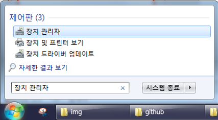

## Putty 설치 및 접속

이 글은 Microsoft Windows 환경에서 IoT Badge를 USB 케이블로 연결하여 REPL로 통신하는 방법에 대한 안내입니다.

## USB 드라이버 설치

USB 드라이버는 [IoT뱃지 위에 ROM 설치하기 중 드라이버 설치하기](../firmware#1-드라이버-설치하기) 항목을 참고하여 미리 설치되어 있어야 합니다.

## Putty 다운로드 및 설치

아래 링크에서 자신의 운영체제에 맞는 파일을 다운로드 합니다.
* Putty 다운로드 링크 : https://www.chiark.greenend.org.uk/~sgtatham/putty/latest.html

## Putty 실행 및 환경 설정

Putty를 실행한 후, `Connection type`에서 `Serial`을 선택해줍니다.

### COM 포트 찾기
`Serial line`에 올바른 COM 포트를 입력하기위해 장치 관리자를 열어 확인하겠습니다.

윈도우 키를 누르고 "장치 관리자"를 입력해 장치 관리자를 실행합니다.
Windows 10의 경우, 작업 표시줄에 돋보기 버튼을 눌러 "장치 관리자"를 검색해 실행합니다.

장치 관리자를 연 후, `포트(COM & LPT)`를 클릭해 `Silicon Labs CP210x USB to UART Bridge`의 COM값을 확인합니다.

### Putty Serial 정보 입력

`Serial line`에 확인한 COM값을 입력해 포트를 설정합니다. `Speed`에는 115200을 입력해 baudrate를 설정합니다.
하단의 `Open`을 클릭합니다.

## REPL 연결

짜잔~! 이제 IoT 뱃지와 REPL로 연결되었습니다!

모두들 IoT뱃지와 함께 즐거운 코딩을!

## Summary
* USB 드라이버 다운로드 : [IoT뱃지 위에 ROM 설치하기 중 드라이버 설치하기](../firmware#1-드라이버-설치하기)
* Putty 다운로드 : https://www.chiark.greenend.org.uk/~sgtatham/putty/latest.html
