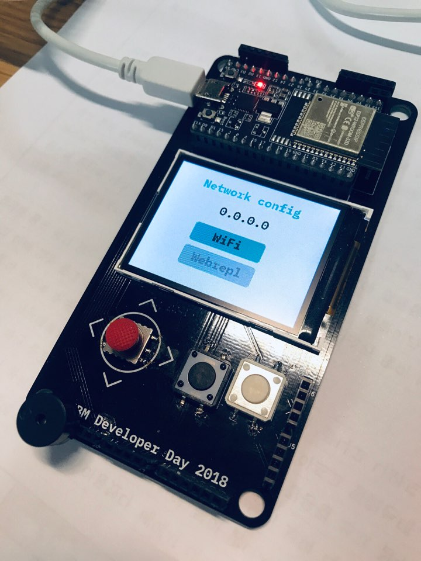
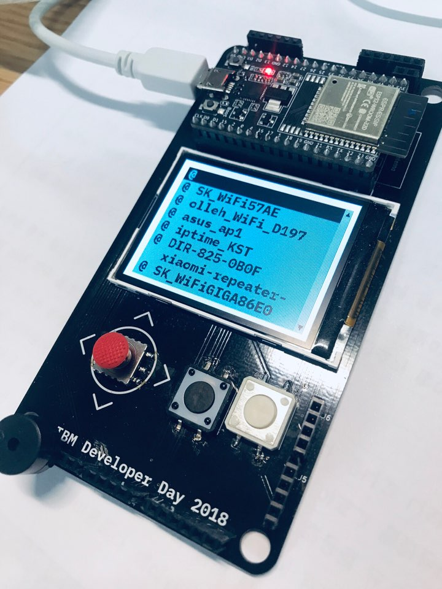
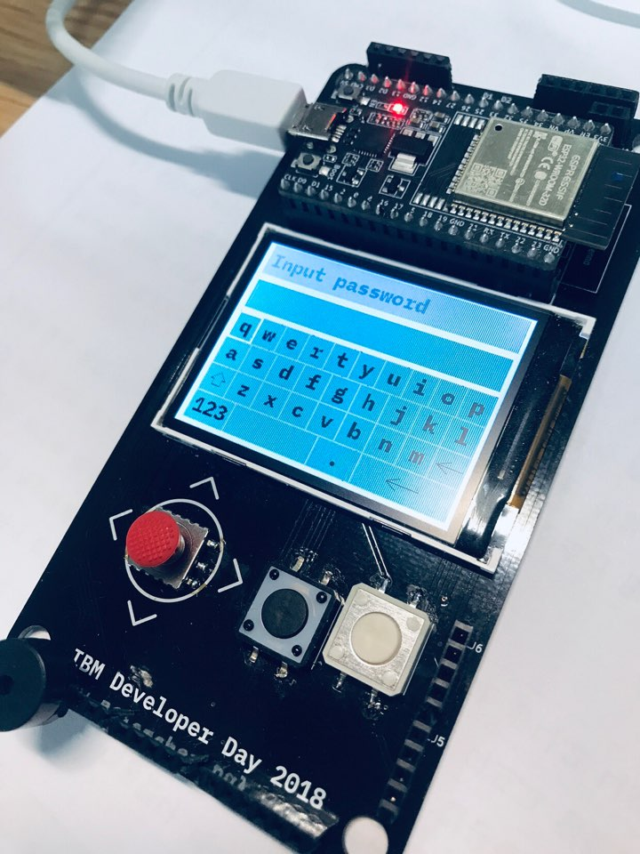
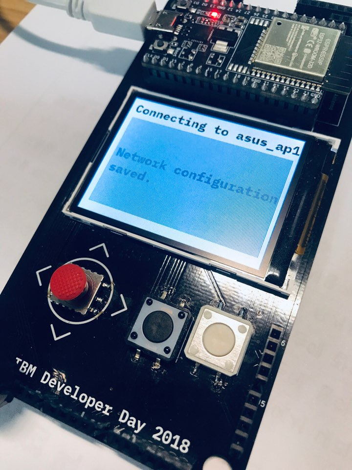
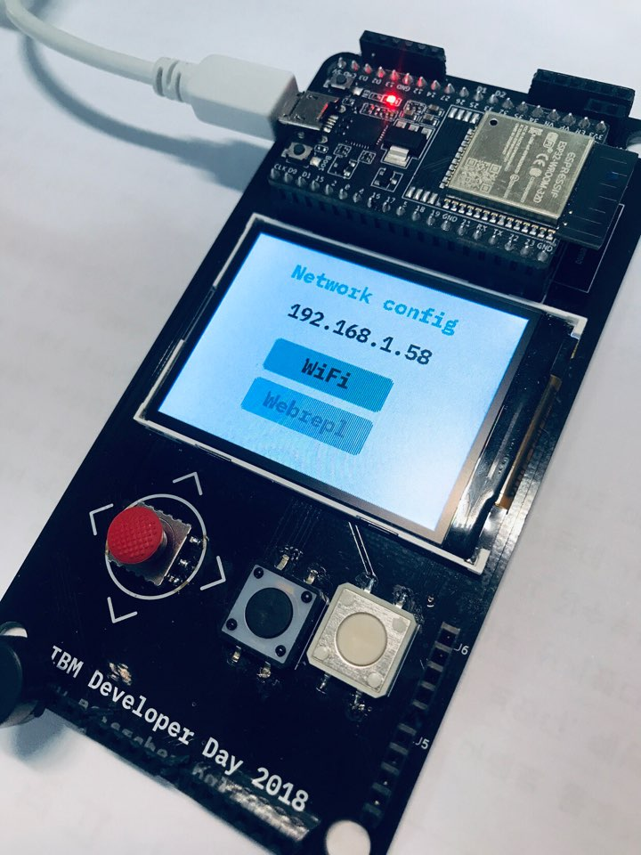
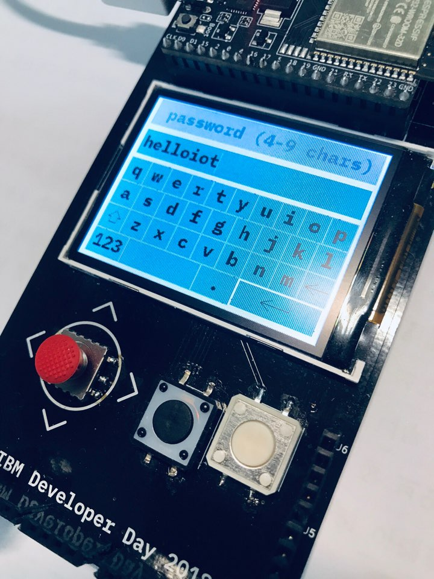
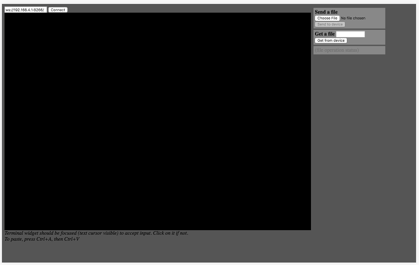
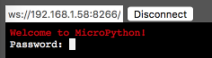
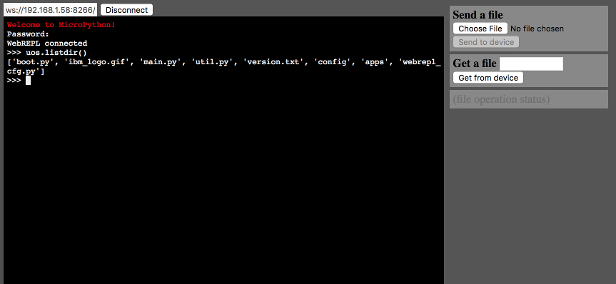
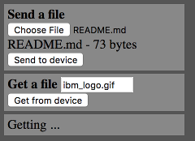

## REPL을 이용하여 IoT뱃지 접속하기

`REPL`은 Read-Eval-Print Loop의 약자로 일종의 명령을 입력하면 그 결과를 보여주는 일종의 Shell 같은 서비스를 말합니다. IBM IoT Badge에는 MicroPython이 포팅되어 있어 USB 케이블을 이용해 Serial 통신 프로그램으로 REPL에 연결 할 수 있습니다.

## USB 드라이버 설치

USB 케이블 연결을 위한 통신 드라이버는 [드라이버 설치하기](../firmware#1-드라이버-설치하기)를 참고합니다.

## Serial 통신 프로그램

USB 드라이버 설치가 완료되었다면 UART 시리얼 통신 프로그램이 준비되어야 합니다. 

### Linux 또는 MacOS

접속 환경이 Linux인경우 `picocom`이나 `minicom`, MacOS의 경우 `screen`이라는 명령을 이용 할 수 있습니다. 드라이버가 설치되었다면 다음 명령으로 컴퓨터에 연결된 USB 포트 정보를 확인합니다. 드라이버가 정상 설치되었다면 보통 '/dev/tty.XXXXXX'와 같은 형식의 이름으로 인식됩니다. 또한 REPL용 Baudrate는 `115200`를 이용합니다. 만약, 컴퓨터가 MacOS이고 USB로 연결된 시리얼 포트가 `/dev/tty.SLAB_USBtoUART`인 경우 다음과 같이 명령을 실행합니다.

``` bash
$ screen /dev/tty.SLAB_USBtoUART 115200
```

### Windows

Windows의 경우 별도 소프트웨어를 설치해야 합니다. 보통은 Putty라는 프로그램을 이용하는데 [Putty 설치하기](Putty.md)를 참고하시기 바랍니다.

## 그냥 사용해 보기

접속을 하고 `Enter` 키를 입력하면 Shell 처럼 `>>>` 프롬프트가 출력됩니다.

``` python
>>>
>>> 
```

현재 사용할 수 있는 명령은 `Tab` 키를 누르면 전역으로 입력할 수 있는 객체 정보가 출력됩니다.

```  python
>>> 
>>> 
__class__       __name__        execfile        gc
json            machine         network         run
sys             time            ugfx            uos
bdev            webrepl         sta_if          ap_if
util            rtc             appname         startup
display_logo    home            reboot          restart
unload          get_version     Config          wait_network
>>> 
```

IoT 뱃지에는 작게나마 File System이 준비되어 있습니다. 현재 저장된 파일의 정보를 확인하기 위해 `uos` 패키지를 이용합니다. `uos` 패키지는 일반적인 파이썬에서 제공하는 `os` 패키지를 **마이크로** 파이썬에 맞춰 축약해 놓았습니다. `uos.lsdir()` 명령으로 현재 디렉토리에 포함된 파일 목록을 볼 수 있습니다.

``` python
>>> uos.listdir()
['boot.py', 'ibm_logo.gif', 'main.py', 'util.py', 'version.txt', 'config', 'apps', 'webrepl_cfg.py']
```

기본 애플리케이션이 설치된 `apps` 폴더에 포함된 파일도 볼 수 있습니다.

``` python
>>> uos.listdir('apps')
['netconfig', 'home', 'appmanager', 'nametag', 'rps']
```

이제 간단하게 python 프로그램을 실행해 볼까요?

``` python
>>> a = 1
>>> b = 2
>>> c = a + b
>>> print(c)
3
>>> 
```

또한, 꼭 파일이 아니더라도 REPL에서 직접 생성하고 실행 할 수 있습니다. 함수 하나를 만들어서 실행해 보도록 합니다.

먼저 다음 내용으로 `test`라는 함수를 만들어 봅니다.

``` python
def test(a, b):
    return a + b
```
그리고 실행합니다.

``` python
>>> print(test(1, 2))
3
>>>
```

## 입력 모드

### 기존 입력 내용

최대 8개까지 기존 입력 내용을 기억하고 있습니다. 방향키 위/아래를 이용합니다.

### 라인 편집

* 방향키 왼쪽/오른쪽으로 커서를 이동할 수 있습니다.
* 해당 입력 줄의 처음으로 이동: Home 또는 Ctrl-A (단, MacOS의 `screen`경우 Ctrl-A가 예약 단축키이므로 동작하지 않음)
* 해당 입력 줄의 마지막으로 이동: End 또는 Ctrl-E

### 붙여넣기 모드

Ctrl-E 키를 누르면 일반 모드에서 붙여넣기 모드로 전환되며, 여러줄의 코드에 대해 복사 & 붙여넣기가 가능해집니다. 붙여넣기가 완료되면 Ctrl-D로 일반모드로 전환하고 내용을 실행합니다.

* 주의 할 점은 REPL로 실행되는 통신환경으로 인해 많은 내용을 한번에 입력할 때 내용이 누락되는 경우가 발생합니다. 정확하게 입력되는지에 대한 확인과 주의가 필요합니다.
* 많은양의 코드가 필요한 경우 네트워크로 연결되는 [WebREPL](WebREPL.md)를 이용하도록 합니다.

## WebREPL

`WebREPL`은 유선 통신으로 연결되는 `REPL`을 무선 통신을 통한 웹으로 제공하는 것을 말합니다. 이 경우 USB 드라이버나 케이블없이 동일한 네트워크 망에 연결된 Web Browser로 IoT 뱃지에 접속할 수 있습니다. WebREPL을 이용하려면 컴퓨터와 IoT 뱃지가 동일한 네트워크에 연결되어 있어야 합니다.

### WiFi 네트워크 연결

사용자는 IoT 뱃지의 방향키를 움직여 메뉴를 선택하고 `A` 버튼을 눌러 선택한 메뉴를 실행할 수 있습니다. 초기 메뉴에서 `Apps` 메뉴에서 애플리케이션 리스트를 확인합니다. 그리고, `Network Config` 애플리케이션을 선택 후 실행합니다.



`Network config`에서 `WiFi`를 선택하면 현재 주위의 WiFi SSID 목록을 표시합니다. 이 중 자신의 컴퓨터에 연결 가능한 WiFi 공유기의 SSID를 선택합니다.



해당 공유기의 WiFi 비밀번호를 입력 후 `↵`를 선택합니다.



정상적으로 연결되면 `Network configuration Saved`라는 메시지와 함께 IoT 뱃지가 재부팅합니다.



### WebREPL 활성화

IoT 뱃지에서 WebREPL을 사용하려면 WiFi 네트워크 설정을 했던 `Network Config` 애플리케이션을 실행해야 합니다. `Network Config` 앱에서 `B` 버튼을 클릭하면 현재 IoT 뱃지의 IP 정보가 표기됩니다. 이 정보를 잘 기억했다가 WebREPL의 접속 IP로 사용합니다.



방향키를 눌러 `Webrepl` 메뉴로 진입하면 WiFi 비밀번호 설정과 유사한 화면이 나타납니다.



이는 WebREPL의 경우 IP를 알면 누구나 IoT 뱃지에 접속할 수 있으므로 이에 대한 기초적인 비밀번호를 설정하는 것입니다. 임의의 값을 입력 후 WebREPL 연결 시 입력하도록 합니다.

그리고, `↵`를 선택하면, `Webrepl password saved.` 란 메시지와 함께 IoT 뱃지가 재부팅됩니다.

### WebREPL 코드 설치

WebREPL은 다음 URL에서 다운로드 받아 놓습니다. 

* https://github.com/micropython/webrepl/archive/master.zip

파일 압축을 해제하면 `webrepl.html` 파일이 있는 것을 볼 수 있습니다. 이 파일을 Web Browser를 실행하여 열면 WebREPL 화면을 볼 수 있습니다.



IoT뱃지의 IP에 맞춰 변경합니다. IP가 `192.168.1.58`인 경우 `ws://192.168.1.58:8266/`와 같습니다.

`Connect` 버튼을 클릭하면 비밀번호 요구하는 화면이 나타납니다.



앞서 설정한 비밀번호를 입력하면 시리얼 케이블로 연결한 REPL과 같은 화면이 나타나고 정상적으로 명령을 인식 실행하는 것을 확인 할 수 있습니다.



### WebREPL을 이용한 파일 송수신

WebREPL의 오른쪽 메뉴를 보면 `Send a file`과 `Get a file`이란 부분이 있습니다. `Send a file`은 파일을 컴퓨터에서 IoT 뱃지로 파일을 보내는 경우, `Get a file`은 IoT 뱃지의 파일을 컴퓨터로 내려 받는 경우 사용합니다.



한가지, 파일 송수신 시 신경 써 주어야 할 부분이 있는데, IoT 뱃지에 접속한 WebREPL의 현재 디렉토리를 기준으로 파일을 보내거나 받을 수 있습니다. 이점은 꼭 주의해야 합니다.


### WebREPL CLI를 이용한 파일 전송

애플리케이션을 개발할 때 WebREPL을 이용하여 코드나 파일을 전송할 수 있습니다. 단, Web browser를 이용하는 경우는 전송 경로 설정이나 버튼을 클릭과 같은 사용자가 직접 해당 동작을 직접 수행 해야 합니다. 이는 개발 시 단순 반복되면서 일정 시간이 소요되는 것으로 소프트웨어 개발 업무 효율을 떨어뜨리게 됩니다. 게다가 Web Browser를 통해 동작하므로 자동화 스크립트나 외부 도구를 사용하기 어렵게 됩니다. 이를 위해 WebREPL에서는 CLI(webrepl_cli.py)를 제공합니다.

만약 특정 경로의 파일을 IoT 뱃지의 특정 경로로 전송하고 싶은 경우 다음과 같이 `webrepl_cli.py`를 실행합니다. 

``` bash
webrepl_cli.py -p helloiot test.py 192.168.1.58:/apps/test/
```

위와 같은 경우 IoT 뱃지의 IP는 `192.168.1.58` 그리고 WebREPL 접속 비밀번호는 `helloiot`, 전송하고자하는 파일은 `test.py` 그리고 전송되는 위치는 `/apps/test/` 디렉토리입니다.

WebBrowser가 아닌 CLI로 파일을 전송할 수 있습니다.

IDE에서 Script Shell 실행을 지원하는 경우 이를 활용한 파일 업데이트 스크립트 세트도 구성 할 수 있습니다.

## Summary

* https://github.com/micropython/webrepl
* https://docs.micropython.org/en/latest/esp8266/tutorial/repl.html
